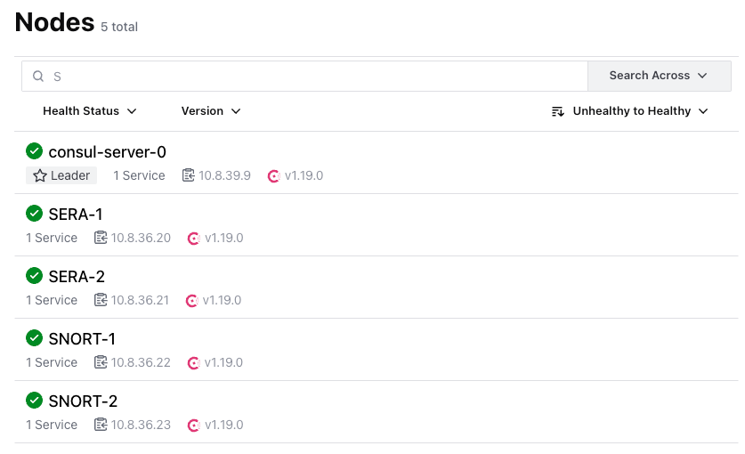
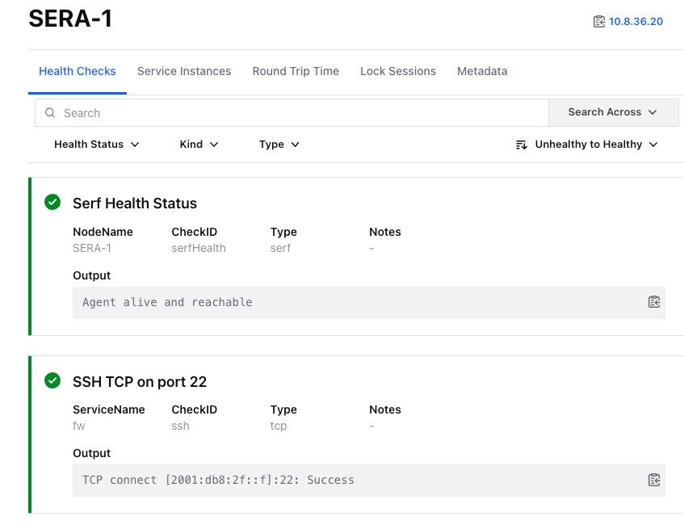
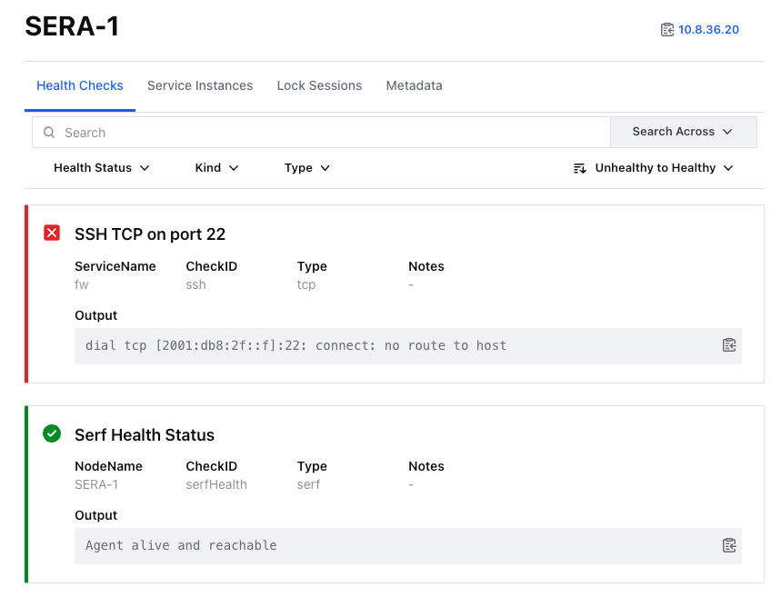

# Design Considerations

## Overview
HawkEye is architected as a highly parallelized system composed of multiple interdependent packages, each responsible for distinct functions within the application. The design leverages the inherent concurrency features of the Go programming language to maximize efficiency and performance.

The diagram below presents a simplified view of the HawkEye application. In this diagram, each color represents a separate Go routine, highlighting the extensive use of parallelism across the application. This parallelism is essential for handling the diverse and simultaneous tasks.

To maintain data consistency and ensure smooth operation across these parallel routines, HawkEye employs several key strategies:

- **Go Channels**: The primary mode of communication between different routines is through Go channels. This approach facilitates non-blocking interactions, allowing the application to process multiple tasks concurrently without delay.

- **Mutexes**: To safeguard data integrity, mutexes are employed at critical points in the application. These mutexes prevent race conditions by ensuring that only one routine can access shared data at a time, thereby avoiding conflicts and preserving consistency.

The combination of these techniques enables HawkEye to efficiently manage the complex tasks of intent processing, real-time network monitoring, and dynamic path calculation, all while maintaining high performance and reliability.

## Key Components

- **jagw**: This package ensures that the network data is always up-to-date. During startup, it requests the necessary link-state information, including nodes, links, prefixes, and SRv6 SIDs. It then subscribes to notifications for any changes in the network. The data is first sent to the adapter package, which validates and converts it to the internal data structures, before being forwarded to the processor for further handling.

- **adapter**: Responsible for validating all incoming data from the jagw and messaging package, this package converts the network data and api requests into the internal data structures used by the system. It ensures consistency and correct formatting before the data is processed by the processor and the controller.

- **processor**: This package processes network data by updating the cache and graph package according to network events. Maintaining an up-to-date graph and cache is critical for fulfilling intents by calculating the optimal path. The processor includes a hold time, configurable via the `HAWKEYE_NETWORK_PROCESSOR_HOLD_TIME` environment variable. If no updates are received within the hold time, the processor sends an update notification, triggering a recalculation of the active sessions.

- **service**: This package handles communication with the Consul service registry, retrieving service information and health checks. It updates the cache with service data, which is then used in path calculations. The service package also sends update notifications when service information changes.

- **graph**: Responsible for creating and updating the network graph, this package manages network nodes and links, along with their characteristics. The graph is crucial for calculating the optimal path, as it serves as the foundation for the algorithm used to find the best route.

- **cache**: This package stores network data in a cache, which is used to enrich the path calculation process. For example, the cache handles the mapping from source and destination addresses to network nodes, and the translation of network nodes to SRv6 SIDs. The cache is continuously updated by the processor and service packages.

- **controller**: The controller package manages the entire session lifecycle. It receives initial requests from the messaging package, manages sessions, and triggers initial calculations. The controller is also responsible for handling network and service change notifications, triggering recalculations for stored sessions as needed. It retrieves results from the calculation package and sends them back to the client when necessary. Additionally, if a session is canceled, the controller removes it from the stored sessions.

- **calculation**: This package contains the core calculation logic, managing both initial calculations and updates. The calculation is based on an extended Dijkstra algorithm that supports multiple factors, utilizing data from the graph and cache. Each calculation is executed, and the result is returned to the controller. More details on the calculation process can be found in the [Calculation Logic](#calculation-logic) section.

- **messaging**: The messaging package is responsible for client communication. It receives initial requests from clients, forwards them to the adapter for validation and conversion, and then passes them to the controller, which manages the session and triggers calculations. The package also ensures that the client receives up-to-date path results throughout the session.

## Cache Design

The cache is a key component in HawkEye's architecture, storing network and service data to improve the efficiency and speed of path calculations. It acts as temporary storage for various types of network information, allowing the system to quickly access and use this data as needed. The cache receives its data from Jalapeno via JAGW and the Consul server API.

### Data Stored

- **Client Networks**: Stores information about client-associated networks, including prefixes and related data. This data is essential for identifying source and destination nodes, as these are the nodes advertising the prefixes.
- **Network Nodes**: Contains information about network nodes, used for handling network updates and maintaining an accurate view of the network topology.
- **SRv6 SIDs**: Holds Segment Routing IPv6 Segment Identifiers from nodes and services. These SIDs are crucial for translating the calculated path into a segment list that needs to be applied to packets.

### Update Mechanism

The cache is continuously updated by the processor and service packages:

- **Processor Package**: Updates the cache based on network events, ensuring that the network topology and related data remain current.
- **Service Package**: Updates the cache with service information and health checks, which are then used in path calculations.

### Example Functionality

Consider a shortest path calculation: the request includes source and destination IP addresses, from which the corresponding network addresses are calculated. These network addresses are then used to obtain the IGP router IDs, which in turn identify the source and destination nodes within the graph. With these nodes identified, the shortest path algorithm is executed from the source to the destination node. The result is a list of nodes, where each node ID corresponds to an IGP router ID. The cache then translates these node IDs into SRv6 SIDs to generate the Segment List.

This process applies similarly to other entities, such as services.

## Graph Design

The graph is a crucial component of HawkEye's architecture, representing the network topology and enabling efficient path calculations. It models the network as a collection of nodes and edges, where nodes represent network devices (e.g., routers) and edges represent the links between them. By maintaining an accurate and up-to-date graph, HawkEye can manage network data effectively and perform real-time path calculations with high performance and reliability.

### Data Structure

The graph is implemented using an adjacency list, which efficiently represents the network topology and supports quick lookups and updates. Each node in the graph corresponds to a network device, and each edge represents a link between two nodes with associated metrics. These metrics include delay, jitter (delay variation), maximum link bandwidth, available bandwidth, packet loss, bandwidth utilization, normalized latency, normalized jitter, and normalized packet loss. This detailed information enables the graph to calculate the optimal path between source and destination or the most efficient service function chain.

### Node and Edge Information

- **Nodes**: Each node retains a record of its connected edges and the specific algorithms it supports.
- **Edges**: Each edge captures essential link metrics, including latency, bandwidth, and packet loss. These metrics play a crucial role in the path calculation algorithms used to determine the optimal network route. Additionally, it tracks whether the edge connects two nodes that support the same algorithm.

### Graph Construction

The graph is built and continuously updated based on network events and data from various sources:

- **Network Events**: The processor package listens for network events (e.g., link state changes) and updates the graph accordingly.

### Subgraphs

The graph can be divided into subgraphs based on Flexible Algorithms (Flex Algos). This allows for path calculations that consider only the nodes and links within the relevant subgraph.

## Service Registry
### Overview
As already mentioned, HawkEye integrates with Consul to monitor service availability and health. This integration ensures that service function chaining remains intact and that paths are adjusted if a service instance becomes unavailable. The service package is responsible for handling communication with the Consul service registry, retrieving service information, and health checks. It updates the cache with service data, which is then used in path calculations. The service package also sends update notifications when service information changes.

### Service Registration and Health Checks
As soon a service instance is operational, it registers with Consul, providing essential information such as the service name and the SRv6 SID. Consul then performs health checks on the service instance, ensuring that it is operational and healthy. HawkEye's service package retrieves this information from Consul and updates the cache accordingly.

Service Registery Overview |  Service Health Check Overview
:-------------------------:|:-------------------------:
 | 

As soon as a health check fails, the service node is marked as unhealthy and excluded from the calculation:

## Calculation Logic

HawkEye features two main types of calculations: shortest path calculation and service function chain (SFC) calculation. Both are based on an extended Dijkstra algorithm, implemented in the calculation package, which uses data from the graph and cache to determine the optimal path or service function chain, expressed as a segment list.

### Calculation Process

HawkEye follows a structured process to translate a path request into a path result that includes the necessary segments. The process begins by identifying the locations of the client and server within the SRv6 network. Using the specified intents, HawkEye calculates the shortest paths from the source router to the destination router, leveraging various metrics such as latency, jitter, packet loss, and bandwidth.

The calculation logic is based on an extended Dijkstra algorithm, which ensures that paths are optimized according to the selected metric or combination of metrics. The result is a segment list that is returned to the requesting end device, ensuring that the network meets the desired intent.

Further details on specific metrics, handling multiple intents, and applying constraints are provided in the following subchapters.

### Shortest Path Calculation

HawkEye's shortest path calculation determines the optimal route between a source and destination node based on various metrics such as latency, jitter, and packet loss. Detailed information about different metrics and intents can be found in the [Intent Overview](intents/overview.md).

The goal is to minimize the cost from the source to the destination, calculated based on the selected metric and intent. The calculation package executes the process using the graph implementation.

Similar to a typical Dijkstra algorithm, the process begins at the source node and explores neighboring nodes to identify the optimal path. The algorithm considers the metrics associated with each edge to calculate the traversal cost from one node to another. Costs are updated as the algorithm progresses, ensuring the identification of the shortest path based on the selected metric. A priority queue is used to manage nodes and their associated costs efficiently. An example of the calculation process is shown below:

#### Metric

- **Jitter, Latency, and Utilization**: These metrics are summed directly during the calculation.
  
- **Packet Loss**: Due to its nature, packet loss is transformed into a cost using the formula `-log(1-p)`, where `p` is the packet loss. This ensures that higher packet loss translates into higher costs, making it compatible with a sum operation.
  
- **High-Bandwidth**: Instead of summing, the algorithm uses the `min` operation to find the path with the highest available bandwidth, effectively identifying the path with the minimum bottleneck.

- **Low-Bandwidth**: Similar to high-bandwidth, but the algorithm identifies the path with the lowest available bandwidth by finding the path with the minimum bandwidth on all links.

#### Multiple Metrics/Intents

HawkEye supports multiple metrics, allowing users to specify desired metrics or intents. When multiple costs are involved, the algorithm calculates a weighted sum of the normalized costs. Environment variables `HAWKEYE_TWO_FACTOR_WEIGHTS` and `HAWKEYE_THREE_FACTOR_WEIGHTS` set the weights for requests involving two or three factors, respectively.

For example, to prioritize low latency and low packet loss, weights can be set to `0.7, 0.3`, and the algorithm calculates the path based on these values, offering significant flexibility to the operator.

More information about the normalization process can be found in the [generic processor documentation](https://github.com/hawkv6/generic-processor/docs/processors/telemetry-to-arango.md#normalization-process)

#### Minimum Constraints

The algorithm supports minimum bandwidth constraints, ignoring links that do not meet the required bandwidth. This ensures that paths have a minimum bandwidth, essential for meeting specific network requirements.

For example, if the minimum bandwidth is set to 5 Mbit/s, the link between XR-1 and XR-2, with only 2 Mbit/s available, is excluded from the calculation.

#### Maximum Constraints

Maximum bearable values for latency, jitter, or packet loss can be specified. Links exceeding these maximums are ignored during the calculation, ensuring paths meet the desired performance thresholds.

For example, if the maximum bearable latency is set to 10 ms, the link between XR-1 and XR-2, which sums up to a total of 15 ms, is excluded from the calculation.

### Service Function Chain Calculation

HawkEye's service function chain calculation determines the optimal sequence of service functions that packets must traverse as they move through the network. This process involves calculating the shortest paths between healthy service instances, ensuring that packets are processed by the specified services in the correct order. Based on the Dijkstra algorithm, the calculation follows these steps:

1. Source node to the first service
2. Paths between service functions
3. Path between the last service and the destination node

The total cost is the sum of these paths, ensuring that the selected service function chain is the most efficient option.

#### Example

In the example below, we calculate the best service function chain that includes a firewall and an IDS. The algorithm determines the shortest path between the source and firewall, between the firewall and IDS, and finally between the IDS and destination. The total cost is the sum of all these paths.

Assume the source is attached to SITE-A and the destination to SITE-B. The firewall is located behind XR-2 and XR-3, and the IDS is located behind XR-6 and XR-7.

Possible service function chains in this example are:

1. Source -> Firewall behind XR-2 -> IDS behind XR-6 -> Destination 
2. Source -> Firewall behind XR-2 -> IDS behind XR-7 -> Destination 
3. Source -> Firewall behind XR-3 -> IDS behind XR-6 -> Destination
4. Source -> Firewall behind XR-3 -> IDS behind XR-7 -> Destination

In the first service function chain combination (highlighted in green), the cost is calculated as follows:

1. Source to Firewall: XR-1 to XR-2
2. Firewall to IDS: XR-2 to XR-6
3. IDS to Destination: XR-6 to SITE-B

In the last service function chain considered (highlighted in pink), the cost is calculated as follows:

1. Source to Firewall: XR-1 to XR-3
2. Firewall to IDS: XR-3 to XR-7
3. IDS to Destination: XR-7 to SITE-B

The service function chain with the lowest cost is selected as the best option. The corresponding segment list is then calculated and returned to the client.

In this case, the first service chain has the lowest cost, making it the optimal choice.

Further information can be found in the [Intent Overview](intents/overview.md).
