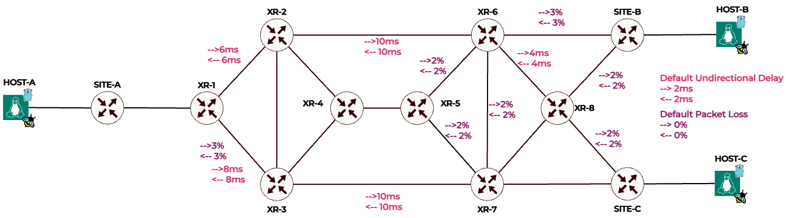

# Combining Two Intents
It is possible to combine the `low latency`, `low jitter`, and `low packet loss` intents to find a specific path between two hosts which is optimized based on these intent combination. The order of these intents influences their weighting, with the first intent receiving a higher weight than the second. By default, the first intent has a weight of 0.7, and the second has a weight of 0.3. These weights can be adjusted by setting the `HAWKEYE_TWO_FACTOR_WEIGHTS` environment variable.

This page demonstrates the functionality using a combination of `low latency` and `low packet loss`. Other combinations, such as `low latency` with `low jitter` or `low jitter` with `low packet loss`, can also be used.

## Network Topology

The network topology below, with the associated latency and packet loss values, is used to demonstrate this intent. The latency impairments were applied using the [Lab Impairment Script](https://github.com/hawkv6/network/blob/main/docs/network.md#lab-impairments-scripts).




## Example Scenarios

These two example scenarios demonstrate how combined intents can be used to optimize the path between two hosts:

1. **Scenario 1**: Prioritizing low latency with packet loss as the secondary factor for the path between Host-A and Host-C.
2. **Scenario 2**: Prioritizing low packet loss with latency as the secondary factor for the path betwen HOST-A and HOST-C.

Note that the order in which the intents are listed influences their weighting, with the first intent receiving higher priority.


### Scenario 1:  Low Latency and Low Packet Loss

In this example, Host-A (acting as a client) requests a path to Host-C (acting as a server) that prioritizes low latency and low packet loss. In this scenario, latency is given higher importance than packet loss, with default parameters assigning a weight of 0.7 to latency and 0.3 to packet loss. The HawkEye controller calculates the optimal path based on these weights to achieve the lowest latency and packet loss between the two hosts.


### HawkWing Configuration
```yaml
---
client_ipv6_address: 2001:db8:a::10
hawkeye:
  enabled: true
  address: 2001:db8:e5::e
  port: 10000
services:
  webserver-c:
    ipv6_addresses:
      - 2001:db8:c::10
    applications:
      - port: 80
        intents:
          - intent: low-latency
          - intent: low-packet-loss
```

### API Request
The `low latency and low packet loss` request is saved `combined intents` folder. The JSON request format is as follows:
```
{
    "ipv6_source_address": "2001:db8:a::10",
    "ipv6_destination_address": "2001:db8:c::10",
    "intents": [
        {
            "type": "INTENT_TYPE_LOW_LATENCY"
        },
        {
            "type": "INTENT_TYPE_LOW_PACKET_LOSS"
        }
    ]
}
```

### Result

The following SID List is generated to ensure an optimized path between the two hosts:

- `fc00:0:1:0:1::`
- `fc00:0:2:0:1::`
- `fc00:0:4:0:1::`
- `fc00:0:5:0:1::`
- `fc00:0:7:0:1::`
- `fc00:0:c:0:1::`

The packets are routed through the devices in this sequence:
HOST-A -> SITE-A -> XR-1 -> XR-2 -> XR-4 -> XR-5 -> XR-7 -> SITE-C -> HOST-C

This path is optimized to minimize both latency and packet loss, with a higher priority given to latency. However, note that the route includes a part with packet loss between XR-5 and XR-7, highlighting the trade-off made to prioritize latency.


### Scenario 2: Low Packet Loss and Low Latency
This scenario is similar to the previous one, but with the order of the intents reversed. It shows how the weighting of the intents affects the path calculation.

### HawkWing Configuration
```yaml
---
client_ipv6_address: 2001:db8:a::10
hawkeye:
  enabled: true
  address: 2001:db8:e5::e
  port: 10000
services:
  webserver-c:
    ipv6_addresses:
      - 2001:db8:c::10
    applications:
      - port: 80
        intents:
          - intent: low-packet-loss
          - intent: low-latency
```

### API Request
The `low packet loss and low latency` request is saved `combined intents` folder. The JSON request format is as follows:
```
{
    "ipv6_source_address": "2001:db8:a::10",
    "ipv6_destination_address": "2001:db8:c::10",
    "intents": [
        {
            "type": "INTENT_TYPE_LOW_PACKET_LOSS"
        },
        {
            "type": "INTENT_TYPE_LOW_LATENCY"
        }
    ]
}
```

### Result

The following SID List is generated to ensure an optimized path between the two hosts:

- `fc00:0:1:0:1::`
- `fc00:0:2:0:1::`
- `fc00:0:3:0:1::`
- `fc00:0:7:0:1::`
- `fc00:0:c:0:1::`

The packets are routed through the devices in this sequence:
HOST-A -> SITE-A -> XR-1 -> XR-2 -> XR-3 -> XR-7 -> SITE-C -> HOST-C

This path is optimized to prioritize minimizing packet loss while still considering latency. The choice of route reflects this priority, as the path includes the higher-latency link between XR-3 and XR-7 to avoid segments with higher packet loss.


