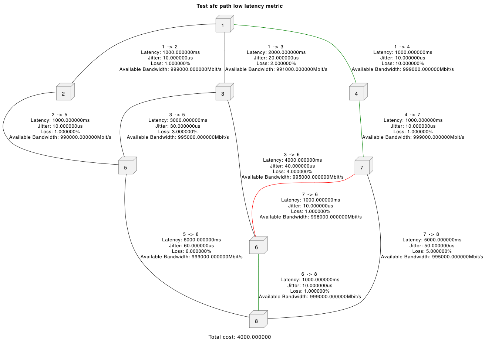

# Unit Tests

Unit tests are implemented to verify the functionality of the HawkEye controller. These tests are automatically executed by the CI/CD pipeline, but they can also be run manually with the following command:

`go test ./... -race -coverprofile=coverage.out -covermode=atomic`

When run manually, the tests not only perform the necessary calculations but also generate a UML diagram. The generated UML diagram is saved in the [`test/uml`](test/uml) directory.

The UML diagram highlights the selected path in green and the bottleneck edge of this path in red.

An example of a generated UML diagram is shown below:

